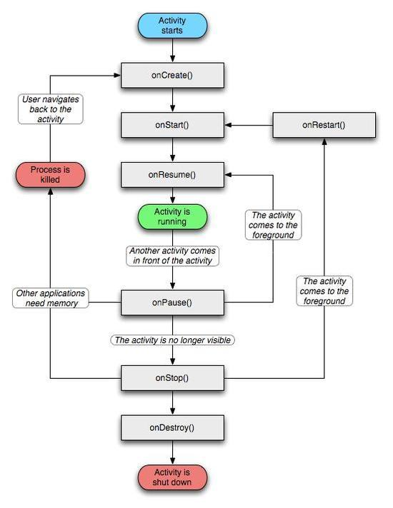

# 알아두면 쓸데있는 안드로이드 짜투리 정보
1년차가 채 되지 않은 안드로이드 개발자가 그동안의 다사다난했던 업무 중 이슈와 그 해결 과정에서 배운 것들, 새로 배울 것들에 관해 정리한 문서입니다.

## 들어가며
저도 신입 개발자긴 합니다만, 그런 제가 봐도 **요즘 안드로이드 신입 개발자**들은 정말 대단합니다. 안드로이드 개발자 수가 많아지기도 했지만, 전반적으로 신입 개발자의 수준이 높아지고 있다는 것도 틀린 말은 아닌 것 같습니다. ~~(물론 제가 수준이 높냐고 물어보면 그건 아닌 것 같습니다)~~

요새 안드로이드 개발자 채용공고를 보면, 대체로 아래와 같은 기술 스택을 요구합니다.
~~~
RxJava, Coroutine, Java(+ Kotlin), MVVM(혹은 MVP), Android Architecture Component(AAC) 등...
~~~

솔직히 말하면 저는 운이 좋게 **배우려는 의지**를 인정받아 첫 회사에 입사했지만, 솔직히 저 위의 기술 스택 중 재대로 알고 있다고 말할만한 내용은 거의 없는 것 같습니다.

회사에 들어오고 일을 하면서도 저런 기술들을 그냥 수동적인 입장에서 사용만 할 뿐, 왜 쓰는지 무엇이 좋은지 이해하고 받아들이는 과정은 없었습니다.

그래서 1차적으로 내가 좀 공부를 해야겠다 싶어서, 더 나아가 2차적으로 별것 아닌 정보지만 한 사람이라도 더 봐주면 좋을 것 같아서 이런 문서를 만들어보게 되었습니다.

~~그래서 좀 불안합니다. 내가 여기 적는 내용이 맞는지 틀린지 정확히 알기엔 제가 너무 부족하기 때문이죠..~~

## 1. Kotlin
-  코틀린의 중첩 클래스는 inner 키워드를 붙여주지 않으면 기본적으로 **static class**로 생성된다.
-  **sealed class**는 enum class의 확장판으로 [뷰 상태를  관리하는데 유용하게 사용]([https://medium.com/@lazysoul/kotlin-sealed-class%EB%A5%BC-%EC%82%AC%EC%9A%A9%ED%95%9C-ui-%EC%83%81%ED%83%9C-%EA%B4%80%EB%A6%AC-1-3-98cf37207c13](https://medium.com/@lazysoul/kotlin-sealed-class%EB%A5%BC-%EC%82%AC%EC%9A%A9%ED%95%9C-ui-%EC%83%81%ED%83%9C-%EA%B4%80%EB%A6%AC-1-3-98cf37207c13))될 수 있다.
- kotlin 버전 1.2부터는 **lateinit**으로 선언된 var 프로퍼티의 초기화 여부를 확인할 수 있다.
	~~~
	if(::property.isInitalized) { doSomething() }
	~~~
- **by lazy**를 사용한 지연 초기화는 val 프로퍼티에만 사용할 수 있으며, 기본적으로 synchronized로 동작한다.
- **Scope Functions (let, apply, run, also, with)**
	- **let()** 함수는 함수를 이어지는 호출한 객체를 블록의 인자로 전달하는 반면, 나머지들은 호출한 객체를 블록의 리시버로 전달한다.
	- **apply()** 함수는 특정 제네릭 클래스 T의 확장함수로 선언되어 객체에서만 호출할 수 있지만, **run()** 함수는 객체 없이도 쓸 수 있다.
	- **with()** 함수는 객체 없이도 호출할 수 있지만, 인자로 들어가는 값의 널 여부를 가리지 않는다.
- **동반 객체(Companion Object)** 
	- 블록 내부의 정적 메소드는 **@JvmStatic** 어노테이션이 없으면 자바에서 정적 메소드로 사용할 수 없다.
	- **companaion object** 블록 내부의 원시타입 정적 필드는 **@JvmField** 어노테이션을 통해 접근할 수 있다.
	- **companion object** 에 이름을 지정할 수 있다.
- **확장 함수(Extension Function)**
	- 보통 dp -> px 변환 등 공통적으로 자주 사용할 가능성이 있는 유틸 함수에 사용.
	- ImageView의 확장 함수를 Foo.class 안에 선언하면, 해당 클래스 내부에 선언된 모든 ImageView의 객체는 그 확장함수를 쓸 수 있다. 따라서 단순히 하나의 ImageView 객체만 필요한 기능을 확장함수로 선언하는 것은 적절하지 않다.
	- 확장 함수의 이름이 겹치지 않도록 주의해야 한다.
- **Collection, Stream**
	- forEach() 메소드는 collection을 iterator로 변환하기 때문에, forEach 메소드가 돌아가는 도중 데이터 size가 변경되면 에러가 발생함.
	- 코틀린의 컬렉션들은 기본적으로 stream을 지원한다. 유용한 기능이 매우매우 많으므로 알아두면 좋다.
	- filter() : 조건에 일치하는 인자만 다음으로 통과시킴
	- take() : 시작부터 인자로 받은 개수만큼 리스트로 반환
	~~~kotlin
	data.forEachIndexed { index, data ->
	if(index >= 3) return;
	print(data)
	}
	// 이 짓거리를

	data.take(3).forEach {
		print(it)
	}
	// 이렇게 바꿀 수 있따.
	~~~
	 - map() : 내부 인자의 타입을 변환 하여 반환할 때 사용
	 - [더 자세한 정보는 여기](https://namget.tistory.com/entry/Kotlin-%EC%BD%94%ED%8B%80%EB%A6%B0-%EC%8A%A4%ED%8A%B8%EB%A6%BC-%ED%95%A8%EC%88%98-map-flatMap-groupBy-filter-take-drop-first-distinct-zip-joinToString-count-any-none-max-min-average)

## Android Component
#### Activity

- 라이프사이클 메소드 중 onStop()과 onDestory() 는 실행이 보장되지 않는다. 우선순위가 높은 앱이 메모리가 부족하다면 시스템이 임의로 언제든지 액티비티를 죽여버릴 수 있기 때문.
- 액티비티가 실행중인 상태에서 화면이 회전할 경우
	- onPause -> onStop -> onDestroy 이 순차적으로 호출되어 액티비티가 종료된 후,
	- onCreate -> onStart -> onResume 가 차례로 호출되어 액티비티가 재실행된다.
- 다른 액티비티가 위에 뜨거나 전원 키를 눌러 화면을 끈다면
	- onPause -> onStop 메소드가 순차적으로 실행된다. 
- 해당 액티비티의 Intent를 생성하는 팩토리 메소드를 액티비티 내부에 static하게 선언할 수 있다. ~~(좋은 방법인지 확실치 않음)~~
	~~~kotlin
	class FooActivity : AppCompatActivity() {
		companion object {
			@JvmStatic
			fun makeFooActivityIntent(context: Context, data: String): Intent {
				return Intent(context, FooActivity::class.java).apply {
					putExtra("key", data)
				}
			}
		}
	}
	~~~

#### Fragment
- 프래그먼트 생성을 위한 팩토리 메소드 패턴
	~~~kotlin
	class BarFragment : Fragment() {
		companion object {
			@JvmStatic
			fun newInstance(data: String) {
				return BarFragment().apply {
					setArguments(Bundle().also { putString("key", data) })
				}
			}
		}
	}
	~~~
## Reference
[https://thdev.tech/](https://thdev.tech/)
[https://www.androidhuman.com/](https://www.androidhuman.com/)
[https://c10106.tistory.com/](https://c10106.tistory.com/)
